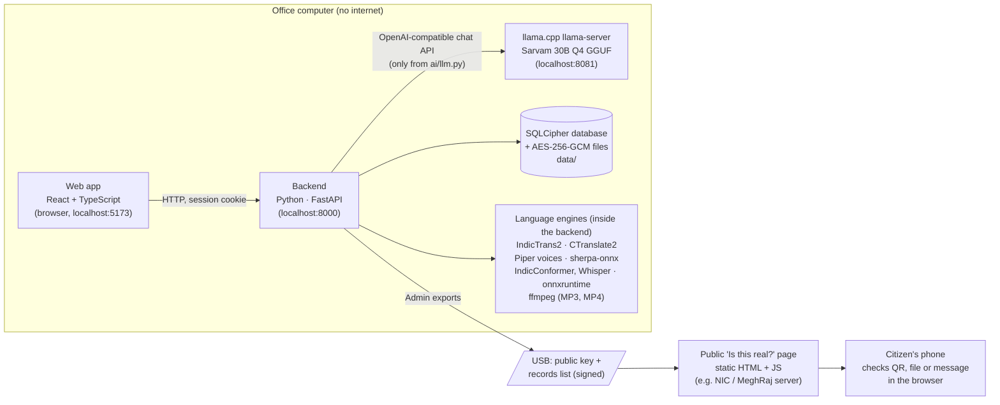
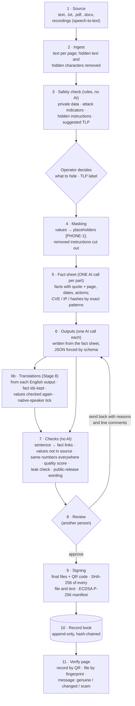

# Pramaan AI · Architecture

Pramaan AI turns one source into seven kinds of official content, offline, with every sentence traceable
to the source and every published file signed and checkable by the public. This note explains how.

## The parts

Three processes run on one computer: the **web app** (static files served by Vite in development), the
**backend** (FastAPI, all rules and checks), and **llama-server** (the Sarvam 30B model). The backend is the
only part that talks to the model, and only through `backend/app/ai/llm.py`; `AI_MODE` in `.env` switches it
between the local model, a rule-based mock (tests and demos) and Sarvam's hosted API (development only).
The language engines (Stage 8) are not separate servers: they are libraries loaded by the backend when
first needed, each behind its own switch in `.env` (`TRANSLATE_ENGINE`, `TTS_ENGINE`, `STT_ENGINE`, each with
a `mock` for tests). They run on the CPU in 8-bit, because recent PyTorch has no Intel-Mac builds.
The public page is a separate static site with no backend: it is updated one way, by USB.

## Data flow

1. **Ingest** (`pipeline/ingest.py`) extracts plain text page by page and removes what a person cannot
   see (white or tiny text in PDFs, hidden Word runs, zero-width characters), noting each removal. A
   recording (audio or video) is turned into text first by speech-to-text (`lang/stt.py`), one "page" per
   2 minutes, and the transcript is shown to the Operator.
2. **Safety check** (`safety/scanner.py`, `shield.py`): regular expressions and checksums (Aadhaar's
   Verhoeff digit, PAN, IFSC, Indian phone and vehicle formats, private IP ranges, key formats,
   classification words) and phrase lists for instructions aimed at the AI. No AI is involved, so the
   check cannot be talked out of its job by the text it reads.
3. **The Operator decides** each finding (hide in public outputs, hide everywhere, keep) and the TLP label;
   every decision is recorded with who and when.
4. **Masking** (`safety/masking.py`) swaps every hidden value for a placeholder before any AI call and
   cuts out removed instructions. The model only ever sees the masked text.
5. **Fact sheet** (`pipeline/factsheet.py`): one call per part of the source (parts fit the 4,096-token
   context). Each fact carries a quote, which is looked up in the real source; facts whose quote is not
   found are flagged, and if too many are, the job is marked "Do not publish".
6. **Outputs** (`pipeline/generate.py`, `ai/prompts/*.md`): each output has its own prompt and JSON schema
   (llama.cpp forces valid JSON). Outputs are written from the fact sheet, not from the source, so the
   long source is read once and all outputs share the same facts. Every text field lists the fact ids it uses.
   **Translations** (`pipeline/translation.py`, `lang/translate.py`) are made from the finished English
   output, field by field, after hidden values are masked; fact ids, indicators and layout are copied, so
   the source trace works in every language. The "Shorter / More formal / Simpler" buttons rewrite one
   English output from its current text and the same fact sheet (`prompts/rewrite.md`).
7. **Checks** (`pipeline/checks.py`, no AI): every sentence is linked to its facts (or flagged "not linked");
   numbers, dates, names and links not in the source are flagged; numbers must agree across outputs; a
   0–100 score is computed; any hidden value that reappears blocks the download (leak check). For a
   translation, every number, date, time, IP, CVE, hash, link, hashtag and placeholder of the English must
   still be there ("Changed in translation" otherwise), and words in another script are flagged.
8. **Review**: a different person (separation of duties is enforced by the backend) comments on lines
   (and can name people with `@`), ticks "Checked by a native speaker" on each translation, then approves
   or sends back with reasons. Edits, rewrites and regenerations keep every version; a translation follows
   every change of its English output.
9. **Signing** (`signing/sign_job.py`): approval makes the final files with a QR code and record number,
   fingerprints every file and every output's text, and signs a manifest. The public version of the
   manifest leaves out the title and texts for TLP:RED and AMBER.
10. **Record book** (`signing/records.py`): each entry stores the hash of the one before it; the database
    refuses updates and deletes; withdrawal is a new signed entry.
11. **Verify page** (`verify-page/`): checks signatures in the browser (Web Crypto, with a built-in
    fallback), a file's SHA-256 against the records, and a pasted message by exact fingerprint, word-level
    similarity (to show what was changed) and scam signs (OTP requests, look-alike links, pressure words).

## Security model

| Threat | Protection |
|---|---|
| Private data reaching the AI or the public | Rule-based scan before any AI; placeholders; public outputs show labels; leak check blocks files; TLP:RED/AMBER switch public outputs off |
| A source that tries to command the AI (prompt injection) | Found by the shield and cut out before the AI reads the source; the source is fenced as data in every prompt; hidden text removed at ingest |
| The AI inventing facts | Outputs written only from the fact sheet; every sentence linked to a fact and its quote checked in the source; unlinked sentences and unknown values flagged in the UI and in the score |
| A translation changing a number, date or link | Every value of the English must survive in the translation (red "Changed in translation" otherwise); "Machine translated - needs a native-speaker check" until a Reviewer ticks it, and approval waits for every tick |
| Wrong person acting | Roles checked in the backend on every endpoint (a matrix test covers all of them); separation of duties; sessions with inactivity and 8-hour limits; lockout; Origin check (CSRF); HttpOnly SameSite=Strict cookie |
| Theft of the computer or its disk | SQLCipher database and AES-256-GCM files; key only in `.env`; backups stay encrypted and exclude the key |
| Silent tampering with history | Hash-chained, append-only audit trail and record book; "Verify chain" recomputes every hash and checks every signature and signed file |
| Fake or edited copies in circulation | Signed records, QR codes, file fingerprints and the public page's message checker; withdrawals published |
| Internet attacks | The office computer needs no network; the public page holds no secrets and is updated one way by USB |

Secrets never appear in logs (a test checks this); there are no default accounts; the first Admin is made at
setup. Admin security settings (scanner checks, classification words, sign-out time, lockout) apply at once
and are recorded in the audit trail.

## Indian technology

| Used now | |
|---|---|
| **Sarvam 30B** (Sarvam AI, Bengaluru) | Writes the fact sheet and every output, on the office computer (GGUF, Q4_K_M) |
| India-specific checks | Aadhaar (with its Verhoeff checksum), PAN, IFSC, Indian mobile numbers, Indian vehicle numbers, Indian classification markings |
| Formats and practice | CERT-In style advisories; Class 3 DSC (CCA) signing via PKCS#11 (designed); cyber-crime helpline 1930 and cybercrime.gov.in on every fake result; GIGW accessibility |
| **IndicTrans2** (AI4Bharat, IIT Madras) | Offline translation of every output into the 22 scheduled languages (en→indic distilled 200M, converted to CTranslate2 8-bit, about 3 s per output on the laptop) |
| **IndicConformer** (AI4Bharat) | Speech to text for Hindi and Tamil recordings (ONNX, 8-bit); Whisper small for English |
| Indian voices | Piper voices trained on AI4Bharat and IIT Madras data: Hindi, Telugu, Malayalam; Urdu; macOS Lekha (Hindi) and Rishi (Indian English) |
| Indian scripts | Noto Sans fonts for 12 Indian scripts with HarfBuzz shaping in every file type, right-to-left Urdu, Kashmiri and Sindhi; the app and the public page in English and Hindi |

| Planned | |
|---|---|
| Indic Parler-TTS (AI4Bharat) | Voices for all 22 languages, once a CPU-friendly (ONNX) build exists |
| Param2 17B (BharatGen) | A lighter model for computers with less memory |

## Offline design

- **No internet at run time.** Fonts, icons and libraries are bundled; there are no CDN links, cloud
  databases or analytics. The model runs locally through llama.cpp's OpenAI-compatible API.
- **Offline installation.** `scripts/make-offline-bundle.sh` collects every Python wheel, npm package,
  llama.cpp, the model and the language and voice models (0.9 GB) on a connected machine, with SHA-256
  fingerprints; `scripts/install.sh` checks and
  installs them on the offline machine (`pip --no-index`, `npm ci --offline`).
- **Slow hardware is expected.** On a 16 GB laptop the 30B model writes about 1–1.3 tokens a second, so:
  prompts are short; the source is read once into the fact sheet and reused (prompt-prefix caching);
  answers are streamed with progress; short outputs are written first; token limits are set per output;
  jobs run in the background, survive restarts, and resume only the parts that failed.
- **The public side stays separate.** The verify page is static and works offline once loaded (service
  worker); it receives only signed data, by USB.

## Scaling to an office server

The same code runs on one office server for a whole team, inside the office network:

1. **AI on a GPU.** Run `llama-server` with GPU offload (CUDA) and several slots (`-np 4`) and a larger
   context; point `LLM_BASE_URL` at it. A data-centre GPU is expected to be tens of times faster than the
   laptop (not measured here). For more users, run several model servers behind one address.
2. **More workers.** Jobs are queued by `pipeline/runner.py`; raise its worker count to match the model
   slots. Each step is saved as it finishes, so workers can be restarted safely.
3. **Serving.** Build the web app (`npm run build`) and serve it and the API from one internal address with
   TLS (e.g. nginx); set `ALLOWED_ORIGINS` to that address. Users only need a browser.
4. **Database.** The SQLCipher file suits a team of tens of users with one job at a time. For many offices,
   `backend/app/db.py` is the single place to move to PostgreSQL with disk encryption; the rest of the code
   uses SQLAlchemy only.
5. **Signing.** Reviewers sign with their own Class 3 DSC tokens (`SIGNER=dsc`, PKCS#11) on the server or
   through a signing station.
6. **Operations.** Scheduled encrypted backups (`backup.py`) to a second disk; the audit trail and record
   book are verified on a schedule; the public page is updated by the Admin's one-way export.
